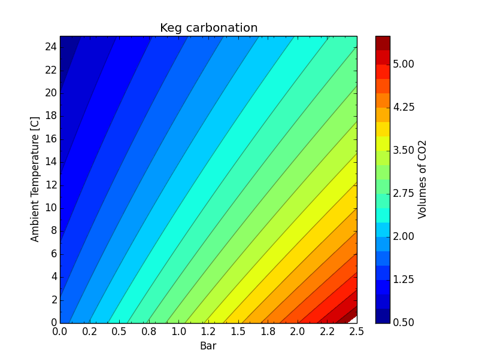

KegCarb
=======

Calculate how many Bar needed to carbonate beer at specified volumes of CO2 under different temperatures

|Type|Carbonation level|
|:---|----------------:|
|German Wheat Beer| 	3.3 - 4.5 volumes|
|Fruit Lambic |	3.0 - 4.5 volumes|
|Lambic |	2.4 - 2.8 volumes|
|American Ales and Lager|    2.2 - 2.7 volumes|
|European Lagers| 	2.2 - 2.7 volumes|
|Belgian Ales| 	1.9 - 2.4 volumes|
|Porter, Stout |	1.7 - 2.3 volumes|
|British Style Ales |    1.5 - 2.0 volumes|
