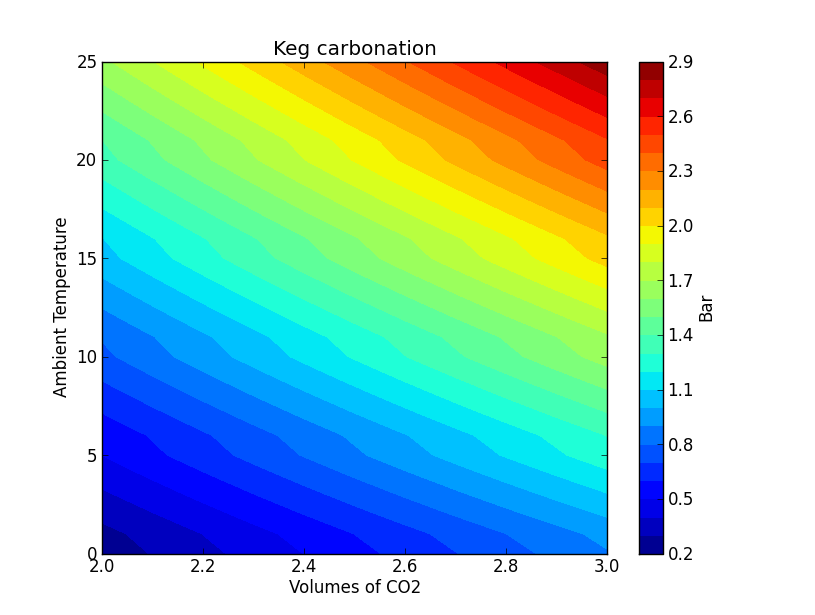

KegCarb
=======

Calculate how many Bar needed to carbonate beer at specified volumes of CO2 under different temperatures

|Type|Carbonation level|
|:---|----------------:|
|British Style Ales |    1.5 - 2.0 volumes|
|Belgian Ales| 	1.9 - 2.4 volumes|
|American Ales and Lager|    2.2 - 2.7 volumes|
|Fruit Lambic |	3.0 - 4.5 volumes|
|Porter, Stout |	1.7 - 2.3 volumes|
|European Lagers| 	2.2 - 2.7 volumes|
|Lambic |	2.4 - 2.8 volumes|
|German Wheat Beer| 	3.3 - 4.5 volumes|

                      
|T    |2.0|2.1|2.2|2.3|2.4|2.5|2.6|2.7|2.8|2.9|3.0|
|----:|---|---|---|---|---|---|---|---|---|---|---|  
|0C  |0.2|0.3|0.4|0.4|0.5|0.6|0.6|0.7|0.8|0.8|0.9|
|1C  |0.3|0.3|0.4|0.5|0.5|0.6|0.7|0.7|0.8|0.9|0.9|
|2C  |0.3|0.4|0.5|0.5|0.6|0.7|0.7|0.8|0.9|0.9|1.0|
|3C  |0.4|0.5|0.5|0.6|0.7|0.7|0.8|0.9|1.0|1.0|1.1|
|4C  |0.4|0.5|0.6|0.7|0.7|0.8|0.9|1.0|1.0|1.1|1.2|
|5C  |0.5|0.6|0.7|0.7|0.8|0.9|1.0|1.0|1.1|1.2|1.3|
|6C  |0.5|0.6|0.7|0.8|0.8|0.9|1.0|1.1|1.1|1.2|1.3|
|7C  |0.6|0.7|0.8|0.8|0.9|1.0|1.1|1.1|1.2|1.3|1.4|
|8C  |0.7|0.7|0.8|0.9|1.0|1.1|1.1|1.2|1.3|1.4|1.5|
|9C  |0.7|0.8|0.9|1.0|1.1|1.1|1.2|1.3|1.4|1.5|1.6|
|10C|0.8|0.9|1.0|1.0|1.1|1.2|1.3|1.4|1.5|1.6|1.6|
|11C|0.8|0.9|1.0|1.1|1.2|1.2|1.3|1.4|1.5|1.6|1.7|
|12C|0.9|1.0|1.1|1.1|1.2|1.3|1.4|1.5|1.6|1.7|1.8|
|13C|0.9|1.0|1.1|1.2|1.3|1.4|1.5|1.6|1.7|1.8|1.9|
|14C|1.0|1.1|1.2|1.3|1.4|1.5|1.6|1.7|1.8|1.9|1.9|
|15C|1.1|1.2|1.3|1.4|1.5|1.6|1.6|1.7|1.8|1.9|2.0|
|16C|1.1|1.2|1.3|1.4|1.5|1.6|1.7|1.8|1.9|2.0|2.1|
|17C|1.2|1.3|1.4|1.5|1.6|1.7|1.8|1.9|2.0|2.1|2.2|
|18C|1.2|1.3|1.4|1.5|1.6|1.7|1.9|2.0|2.1|2.2|2.3|
|19C|1.3|1.4|1.5|1.6|1.7|1.8|1.9|2.0|2.1|2.2|2.4|
|20C|1.4|1.5|1.6|1.7|1.8|1.9|2.0|2.1|2.2|2.3|2.4|
|21C|1.4|1.5|1.6|1.7|1.8|1.9|2.1|2.2|2.3|2.4|2.5|
|22C|1.5|1.6|1.7|1.8|1.9|2.0|2.1|2.3|2.4|2.5|2.6|
|23C|1.5|1.7|1.8|1.9|2.0|2.1|2.2|2.3|2.5|2.6|2.7|
|24C|1.6|1.7|1.8|2.0|2.1|2.2|2.3|2.4|2.5|2.7|2.8|
|25C|1.7|1.8|1.9|2.0|2.2|2.3|2.4|2.5|2.6|2.7|2.9|
